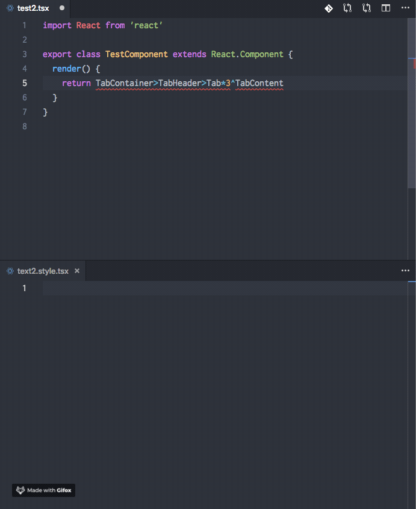

# Styled-Components Extractor

Compose [styled-components](https://www.styled-components.com/) FASTER

1. (Recommended) Use [Emmet](https://emmet.io/) to create JSX element tree
2. Extract unbound components to clipboard, then paste it where approriate
3. (Recommended) Use TypeScript to `auto import` those components



## Usage

Use VS Code Command: `Extract styled-components` (or `Extract exported styled-components`)

Optionally, You can bind these commands to shortcuts via `File -> Preferences -> Keyboard Shortcuts`.

Example:

```json
[
  {
    "key": "cmd+alt+e",
    "command": "styledComponentsExtractor.extract",
    "when": "editorFocus"
  },
  {
    "key": "ctrl+alt+e",
    "command": "styledComponentsExtractor.extractExported",
    "when": "editorFocus"
  }
]
```

## Configuration

```json
{
  // Add `import styled from 'styled-component'` statement if variable `styled` is unbound
  "styledComponentsExtractor.addImportStatement": true
}
```

## Release Notes

### 0.0.1

First release
